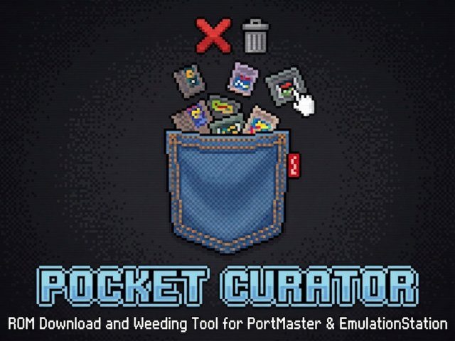
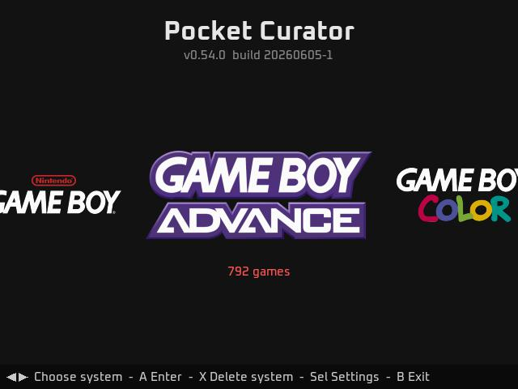
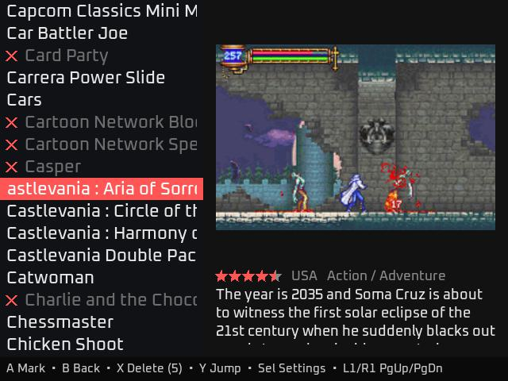

# Pocket Curator

**An on-device ROM and scraped-media cleanup tool for retro handhelds.**
Browse your installed systems and games in an Emulation-Station-style interface, then mark and delete ROMs together with their scraped files. No PC, no SSH, no SAMBA, no WiFi, no SD card swapping. 
(* installation requires Internet connection and may require a PC, after you install, Internet connectivity is unnecessary)

## Why This Exists

Let's face it, unless you're one of those hyper-organized people with a finely curated collection of ROMs, you probably have THOUSANDS of ROMs you don't want or need. Sure, it feels good to have EVERY SINGLE ROM EVER, but after the initial shine wears off, you realize that you need to trim the collection down to what works for YOU. Pocket Curator is here to help with that.

Pocket Curator helps you:
   - Trim the fat from your collection right on the device
   - Gives you a visual way to remove ROMs you don't want
   - Shows the ROM's screenshot and description and details letting you make an informed decision
   - Deletes not only the ROM files, but also the scraped files associated with the ROM, giving you precious space back
   - Multiple deletes are EASY! No faffing about through menus. No wearing your thumbs out.
   - Mark as many ROMs for deletion as you want, then with two button presses delete the all the marked ROMs and their scraped files.

How does deleting ROMs work in Pocket Curator?
Simple. You're in a visual interface that looks just like Emulation Station. (sorry, your themes aren't implemented) You scroll through the games list, just like you do in Emulation Station. Press A to mark a game to be deleted. Keep scrolling and marking. When you're done marking, press X to view a list of what you're about to delete and how much space you'll get back. Press X again to confirm the delete and the games and their scraped files are deleted. When you exit Pocket Curator, it automatically refreshes your games list. Easy, fast, and efficient!

Sure, there are tools to weed ROM collections on your PC. And if that's your thing, you do you. Enjoy. If that's not your thing, then Pocket Curator is the answer. Frankly: I find weeding on my PC to be a real chore. I'm far more likely to do a little cleanup here and there, especially when I can do it right on the handheld. Pocket Curator will lets you do that.

Pocket Curator makes a couple assumptions about you and your ROM collection:
   - You already scraped all your ROMs (you might have gotten them that way from a vendor)
   - You have a bunch of ROMs that are just cluttering up your games lists preventing you from focusing on and playing the real gems
   - You just can't be bothered swapping your sd card back to your PC and installing/configuring programs to weed the collection over there
   - You just want an easier way to delete ROMs right from Emulation Station

Most handheld firmwares let you delete a game from the menu. Frankly that process takes way too many button presses. It usually involves holding a button, scrolling through a menu, and selecting that item from the menu. That doesn't sound like a lot, and it isn't for one or two games. But when you're trying to weed your collection, or trying to make room for another large game, that's where Pocket Curator comes to the rescue!

Pocket Curator is a powerful deletion tool. You can even delete whole systems! Tired of seeing Amstrad CPC in your systems list? (How'd it even get there? LOL) One press of X at the systems carousel and a confirmation, and it will delete all the games and scraped media for that whole game system! Be careful with this one. There is no UNDELETE!

## What Gets Deleted

For each marked game, Pocket Curator removes the ROM/zip file plus the media its `gamelist.xml` entry explicitly references — `<image>`, `<thumbnail>`, `<marquee>`, `<video>`, and `<manual>`. Only files named in the gamelist entry are touched.

## Targeted Firmwares

Pocket Curator was made for Rocknix, plain and simple. But I have enough other handhelds that I made it work with Knulli, dArkOS, Batocera, and AmberELEC as well.

   - Rocknix 2026-06-01 or later - RECOMMENDED
   - Knulli Scarab 2026-05-11 or later - RECOMMENDED
   - dArkOS 06072026 or later (only tested on R36S)
   - Batocera v39 2024-03-05 (only tested on RG552)
   - AmberELEC 2023-02-03 (only tested on RG552)
   
Be sure to update your PortMaster installation as well as install the latest version of your firmware. Without a recent version of both (firmware and PortMaster) Pocket Curator will likely fail. Previous versions of firmwares listed above are untested.

## Unsupported Firmwares

It is VERY unlikely that I will do any development for the below firmwares or any unlisted firmwares:

   - ArkOS - untested and unlikely to work. This OS is no longer in development.
   - EmuELEC - untested... it might work
   - GarlicOS - untested and unlikely to work
   - JELOS might work... (why haven't you upgraded to Rocknix? No plans to develop for or test on this firmware.)
   - MuOS - untested and unlikely to work
   - MinUI - untested and unlikely to work
   - OnionOS - untested and unlikely to work
   - PAN4ELEC - untested... it might work

(The number of untested/unsupported firmwares listed above are likely the reason this 'port' won't ever get picked up into the official
PortMaster repository. So Pocket Curator won't ever be downloadable through the PortMaster ports library)

## Requirements

   - Firmware that supports PortMaster
   - Retro Handheld with working Internet connection (obviously not all handhelds are supported, see list of tested handhelds below)
        - Caveat: you CAN manually install Pocket Curator without an Internet connection - just copy the release .zip file to your ports folder and unzip it
   - At least one other Port installed (often the Ports system won't show up on the systems carousel until you have an official PortMaster port installed, I recommend 2048. It's small and quick to install)
   - aarch64 libraries (don't worry, you probably won't know if you have these or not)

## Tested Handhelds (working!)

I have personally tested Pocket Curator on:

Anbernic:
   - RG CubeXX
   - RG 35xx H
   - RG 35xx SP
   - RG 40xx H & V
   - RG 552
   - BatleXP G350 (You will need a wifi dongle for installation!)

Powkiddy:
   - RGB10 MAX3
   - RGB20 Pro
   - RGB30
   - V10 (You will need a wifi dongle for installation!)
   - V90S (You will need a wifi dongle for installation!)
   - X35H (You will need a wifi dongle for installation!)
   - X55

TrimUI:
   - Brick
   - Brick Hammer
   - Smart Pro
   - Smart Pro S

Misc:
   - R36S (You will need a wifi dongle for installation!)
   - R36H (You will need a wifi dongle for installation!)
   - Kinhank K36 (You will need a wifi dongle for installation!)

I see no reason Pocket Curator would NOT work on any handheld that is supported by Rocknix or Knulli, so long as it uses the libs.aarch64 libraries and you can get the device connected to the Internet for the installation, it should work just fine. After installation, Pocket Curator operates without need for an Internet connection, a PC, or for you to remove your SD card. **You DO need sn Internet connection for the update checker / update installer.**

## Quick Install Instructions

 1) Boot up your handheld and make sure you have:
     - up to date firmware
     - up to date PortMaster
     - at least ONE Port installed with PortMaster (or Ports won't show as a system in some firmwares)
     - a good connection to the Internet for your handheld (WiFi or even via USB tethering)
 2) Download the PocketCurator.Installer.sh from most recent release page. https://github.com/tomtombombadil/PocketCurator/releases
 3) Copy PocketCurator.Installer.sh to the ports folder on your SD card. (You can do this via SSH, SCP, SAMBA, or simply remove the SD card and put it in your PC)
 4) From the Main Menu in Emulation Station, select GAME SETTINGS and UPDATE GAMESLISTS. This will refresh the list of your games, and make PocketCurator.Installer appear on your list of Ports.
 5) Go into the Ports system in Emulation Station, and highlight PocketCurator.Installer and press A to run it.
 6) PortMaster will show some installation messages and install the latest release of Pocket Curator. When it finishes, Emulation Station will refresh your gameslist again.

That's it! Easy peasy lemon squeezy. ;)

## Controls

**Systems carousel:**
   - Left/Right - scroll through your game systems
   - A - go to games list for that system
   - X - delete that game system (it goes to a confirmation dialog, it won't delete anything on an first accidental press)
   - B - exit Pocket Curator (offers a confirmation - press B again to exit)
   - Select - Settings

**Games list:**
   - Up/Down - scroll through your games
   - Left/Right - go to previous/next system's games list
   - A - mark/unmark a game for deletion (hold to mark lots of games at once!)
   - B - back to system selection / cancel action
   - X - delete marked games
   - Y - open alphabet, select letter to jump to that letter in your games list
   - L1/R1 - PgUp/PgDn in your games list
   - L2/R2 - scroll game description
   - Select - Settings

## Settings

Pressing Select will take you to the Pocket Curator Settings screen. These settings are available:
   - Update Pocket Curator - if you're connected to the Internet and your clock is set properly, it will check this GitHub repo for the latest version and install it for you
   - Font Size - changes the size of the font in Pocket Curator.
   - Auto-scroll description - enabling this will cause the game descriptions on the games list to scroll automatically up and down
   - Safe Mode - enabling this will cause Pocket Curator to NOT delete anything! You can use this to test it out without fear.
   - Delete Scraped Media - this is enabled by default, turning it off will cause Pocket Curator to ONLY delete the game ROM/ZIP file. It will NOT delete the scraped files for that game.
   - Rating Display - two options here Text & Stars. It controls which appears in games list display for the rating of the game: stars or a number.
   - About Pocket Curator - shows some status information about what Pocket Curator knows about your handheld

The Settings screen also shows a line of help text for the selected setting, and a line of help text for controls.

Settings persist in `pocketcurator/settings.json`.

## System Logos

Pocket Curator ships **no** system logos of its own; it reads them from your installed themes the way EmulationStation does (at least MOST of the time!) If Pocket Curator can't find your theme's system logos it will fall back to the Rocknix/Knulli defaults. Pocket Curator also tries to determine your region so it can give you the correct system logos (for example: SNES for North America, and Super Famicom for Japan)

## Troubleshooting

- **First launch errors about a runtime/download** — needs an Internet connection once; get your device connected and relaunch.

## Building / packaging

This port bundles the `pygame` wheel for aarch64. See
[`pocketcurator/BUILD.md`](pocketcurator/BUILD.md).

## Credits and license

Released under the **MIT License** — see [`LICENSE`](LICENSE). Thanks to the **PortMaster** team. Bundled **Oxanium** font under SIL OFL 1.1; `pygame` under the LGPL (see `pocketcurator/licenses/`).

Pocket Curator's code and development gratuitously used Claude.ai. I'm not a programmer, but using AI, I was able to put this together to fulfill a need I had. I hope you find it useful as well.
